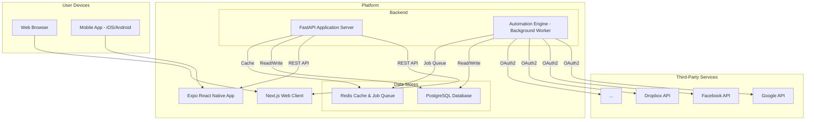

# Action-Reaction Full-Stack Architecture Document

### Section 1: Introduction

This document outlines the complete full-stack architecture for the "Action-Reaction" project, including backend systems, frontend implementation, and their integration. It serves as the single source of truth for AI-driven development, ensuring consistency across the entire technology stack. This unified approach combines what would traditionally be separate backend and frontend architecture documents, streamlining the development process for modern full-stack applications where these concerns are increasingly intertwined.

**Starter Template or Existing Project**
N/A - This is a Greenfield project that will be built from scratch based on the technology stack defined in this document.

**Change Log**

| Date | Version | Description | Author |
| :--- | :--- | :--- | :--- |
| 2025-09-15 | 1.0 | Initial Architecture Draft | Youssef Mehili |

### Section 2: High Level Architecture

**Technical Summary**
The "Action-Reaction" platform is a containerized, full-stack application. It utilizes a **Monorepo** structure to manage a **Next.js (web)** frontend, an **Expo React Native (mobile)** app, and a **Python FastAPI** backend. The backend follows a **Service-Oriented Architecture**, with a PostgreSQL database for primary data storage and Redis for caching and background job queuing. A root `Makefile` orchestrates Docker commands and standardizes the development workflow. This architecture is designed for scalability and extensibility, allowing for the seamless addition of new third-party service integrations as the platform grows, directly supporting the goals outlined in the PRD.

**Platform and Infrastructure Choice**
*   **Platform:** **Railway** has been selected as the deployment and hosting platform. Its infrastructure-as-code approach simplifies the management of services and environments.
*   **Key Services:**
    *   **App Service**: To run the containerized FastAPI backend.
    *   **PostgreSQL**: For the primary relational database.
    *   **Redis**: For caching and to serve as a message broker for the background automation engine.
*   **Deployment Host and Regions:** Railway manages this automatically, optimizing for performance and availability.

**Repository Structure**
*   **Structure:** A **Monorepo** houses all parts of the application. This simplifies dependency management and ensures consistency.
*   **Package Organization:** The monorepo has the following top-level application directories:
    *   `apps/web`: Next.js web client.
    *   `apps/mobile`: Expo React Native mobile app.
    *   `apps/server`: FastAPI backend.
    *   A root `Makefile` provides convenient commands for building, running, and testing the applications.

**High Level Architecture Diagram**

**Architectural Patterns**
*   **Monorepo Pattern:** A single repository will be used to manage the frontend and backend codebases, simplifying development workflows and dependency management.
*   **Service-Oriented Architecture (Backend):** The FastAPI backend will be structured into logical services (e.g., `UserService`, `AutomationService`, `IntegrationService`) to ensure a clear separation of concerns and promote modularity.
*   **Repository Pattern (Backend):** The data access logic will be abstracted into a repository layer. This will decouple the business logic from the database, making the application easier to test and maintain.
*   **Background Worker Pattern (Backend):** The core automation engine will run as a separate background worker process. It will listen for jobs on a Redis queue, allowing the main API server to remain responsive while long-running automations are executed asynchronously.
*   **Frontend State & Navigation:** React state and Context are used initially on web (Next.js); React Navigation is used on mobile (Expo RN). These may evolve to a more formal state manager as complexity grows.

### Section 3: Tech Stack

This table represents the definitive technology selection for the entire project. All development must adhere to these choices to ensure consistency and maintainability. The latest stable versions of these technologies should be used.

| Category | Technology | Purpose | Rationale |
| :--- | :--- | :--- | :--- |
| **Backend Language** | Python | Core language for the application server | Modern, stable, with excellent library support for web services. |
| **Backend Framework**| FastAPI | Web framework for building the REST API | High performance, asynchronous support, and automatic API documentation. |
| **Database ORM** | SQLAlchemy | Object-Relational Mapper | Industry-standard ORM for Python, excellent integration with FastAPI. |
| **DB Migrations** | Alembic | Database migration tool | Handles database schema changes in a version-controlled manner. |
| **Async Task Queue** | Celery | Background job processor | Robust, distributed task queue ideal for handling asynchronous automations. |
| **Frontend Language** | TypeScript | Language for web and mobile clients | Strong typing for React-based web and React Native mobile apps. |
| **Frontend Frameworks**| Next.js (web), Expo React Native (mobile) | UI frameworks for web and mobile | Aligns with current codebase: Next.js for web, Expo RN for mobile. |
| **State Management** | React state/Context (initial) | Manage UI state and data flow | Simple, scalable baseline; can evolve to a dedicated manager if needed. |
| **HTTP Client (FE)** | fetch (native) | Client-server communication | Standards-based API available in both web and React Native (via polyfill). |
| **Routing (FE)** | Next.js App Router (web), React Navigation (mobile) | Navigation and routing | Matches frameworks used in each client. |
| **Primary Database** | PostgreSQL | Relational data storage | Powerful, open-source object-relational database system. |
| **Cache / Job Broker**| Redis | In-memory data store | Used for caching, session storage, and as a message broker for Celery. |
| **Containerization** | Docker | Application containerization | Standardizes the development and production environments. |
| **Orchestration** | Docker Compose | Multi-container application management | Defines and runs the multi-service application stack (server, db, etc.). |
| **Build Tool** | Makefile | Command runner for development tasks | Provides simple, standardized commands for building, running, and testing. |
| **Deployment** | Railway (planned) | Hosting and infrastructure platform | Simplifies deployment and management of the entire application stack. |
| **Testing (Backend)**| pytest | Testing framework for Python | The standard for writing simple and scalable tests in Python. |
| **Testing (Frontend)**| Jest + Testing Library (web), RNTL (mobile) | Unit/integration testing | Common testing stacks for React and React Native. |
| **Linting (Backend)**| Ruff | Python linter | Extremely fast and comprehensive linter to enforce code quality. |
| **Linting (Frontend)**| ESLint + Prettier | Linting/formatting for TypeScript/React | Standard tools for consistent code quality and style. |

### Section 4: Data Models

#### User Model
**Purpose:** Represents an individual user account on the platform. This model stores authentication details, role, and subscription status.
**Key Attributes:** `id`, `email`, `hashed_password`, `is_confirmed`, `role`, `subscription_status`, `created_at`, `updated_at`.
**Relationships:** A `User` has many `ServiceConnections` and `AREAs`.

#### ServiceConnection Model
**Purpose:** Represents the link between a user on our platform and their account on a third-party service. This model securely stores the authentication tokens required to act on the user's behalf.
**Key Attributes:** `id`, `user_id`, `service_name`, `encrypted_access_token`, `encrypted_refresh_token`, `expires_at`, `created_at`.
**Relationships:** A `ServiceConnection` belongs to one `User`.

#### AREA Model
**Purpose:** Represents a user-defined automation workflow supporting multi-step sequences.
**Key Attributes:** `id`, `user_id`, `name`, `enabled`, `created_at`, `updated_at`.
**Relationships:** An `AREA` belongs to one `User` and has many `AreaSteps` (ordered by position).

#### AreaStep Model
**Purpose:** Represents a single step in a multi-step automation workflow.
**Key Attributes:** `id`, `area_id`, `position`, `step_type` (ACTION/REACTION/CONDITION/DELAY), `service_slug`, `action_key`, `config` (JSONB), `created_at`, `updated_at`.
**Step Types:**
- `ACTION`: Trigger step that initiates the workflow (e.g., time-based trigger)
- `REACTION`: Action step that executes in response (e.g., send notification)
- `CONDITION`: Conditional logic gate (future enhancement)
- `DELAY`: Wait period between steps (future enhancement)
**Constraints:**
- Unique constraint on `(area_id, position)` ensures sequential ordering
- First step must be of type ACTION
- ACTION/REACTION steps require `service_slug` and `action_key`
- CONDITION/DELAY steps do not require service information
**Relationships:** An `AreaStep` belongs to one `AREA`.

### Section 5: API Specification

The application server will expose a RESTful API that adheres to the OpenAPI 3.0 specification. All endpoints will be prefixed with `/api/v1`. Authentication will be handled via bearer tokens (JWTs).

**Core Endpoints:**
*   `/auth/register`
*   `/auth/login`
*   `/auth/{provider}` & `/auth/{provider}/callback`
*   `/users/me`
*   `/services`
*   `/connections` & `/connections/{connection_id}`
*   `/areas` & `/areas/{area_id}`
