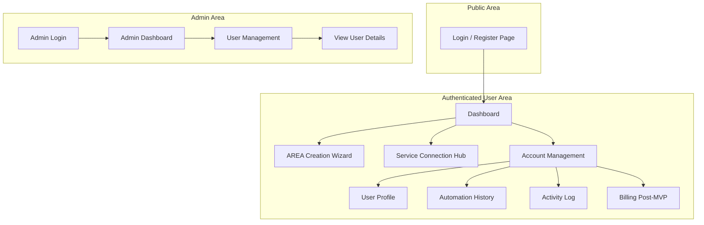
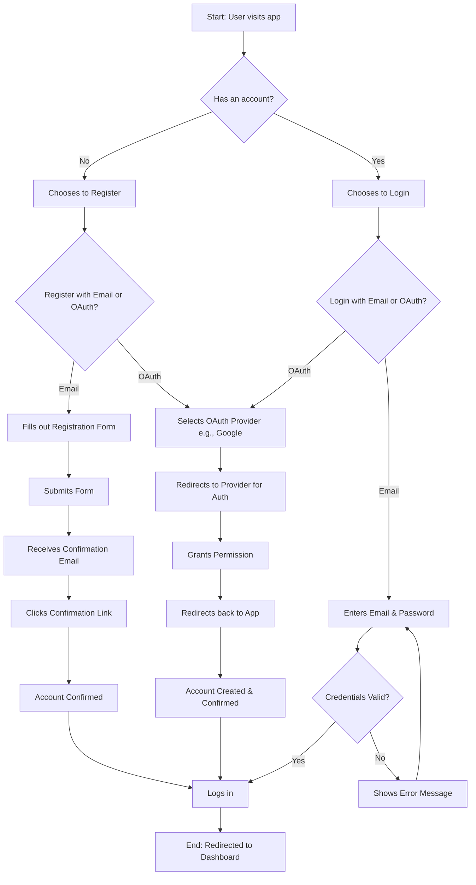
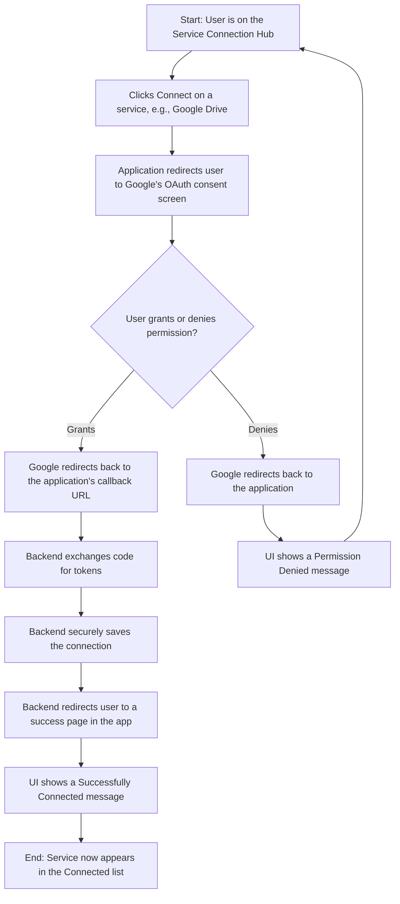
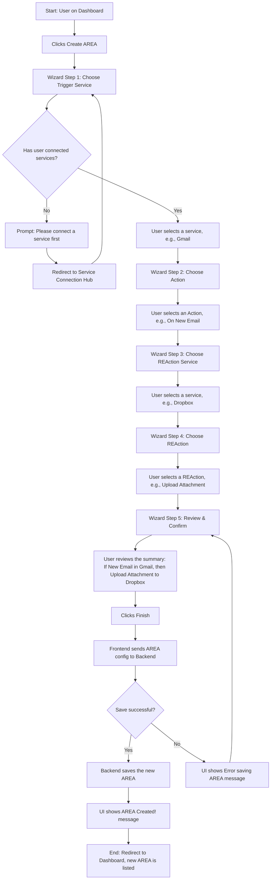
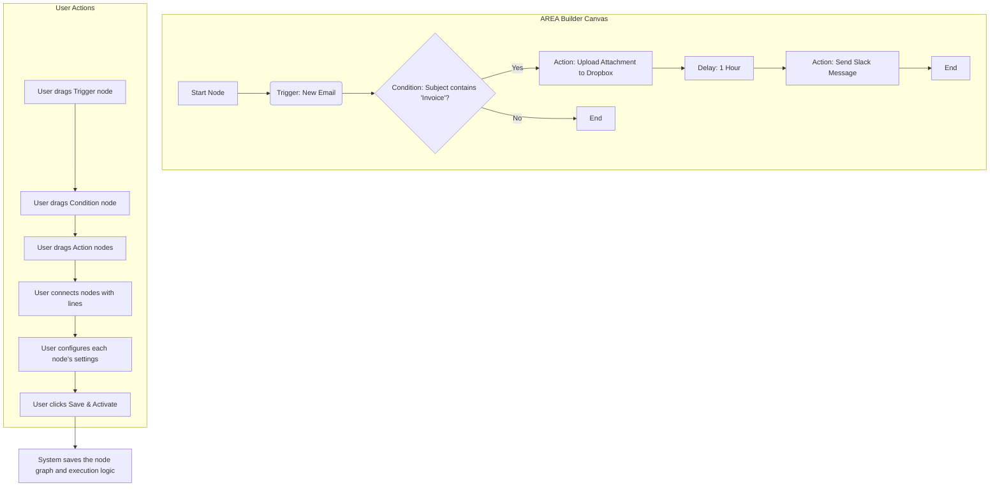

# Action-Reaction UI/UX Specification

### Section 1: Introduction & Overall UX Goals & Principles

This document defines the user experience goals, information architecture, user flows, and visual design specifications for the "Action-Reaction" platform's user interface. It serves as the foundation for visual design and frontend development, ensuring a cohesive and user-centered experience.

**Target User Personas**
*   **The Everyday Integrator**: A moderately tech-savvy user who wants to save time by connecting their daily apps (social media, email, cloud storage) without writing code. They value an intuitive, guided experience.
*   **The Administrator**: A platform manager who needs a clear and efficient dashboard to manage user accounts and ensure the platform is operating smoothly.

**Usability Goals**
*   **Ease of Learning**: A new user should be able to connect two services and create their first simple "AREA" in under 5 minutes.
*   **Efficiency of Use**: Creating a new automation should feel intuitive and require minimal clicks.
*   **Error Prevention**: The interface must provide clear feedback and confirmation steps to prevent users from making mistakes.
*   **Memorability**: An infrequent user should be able to return to the platform and create a new automation without needing to re-learn the entire process.

**Design Principles**
1.  **Clarity Above All**: Prioritize clear, simple language and visual cues over clever or abstract design. The user should always understand what is happening and what to do next.
2.  **Guided Progression**: The UI should act as a guide, leading the user step-by-step through complex processes like connecting services and building automations.
3.  **Consistent Patterns**: Use familiar and consistent UI patterns throughout the web and mobile applications to create a predictable and trustworthy experience.
4.  **Immediate Feedback**: Every user action, from a button click to a successful connection, must provide immediate and clear visual feedback.

**Change Log**

| Date | Version | Description | Author |
| :--- | :--- | :--- | :--- |
| 2025-09-15 | 1.0 | Initial UI/UX Spec Draft | Youssef |

### Section 2: Information Architecture (IA)

**Site Map / Screen Inventory**
This diagram shows the primary screens of the application and how they are connected.

**Navigation Structure**
*   **Primary Navigation (Authenticated User)**: After logging in, the user will have a persistent main navigation bar (e.g., a sidebar or top header). This will provide access to the core sections of the application:
    *   **Dashboard** (My AREAs)
    *   **Connections** (Service Hub)
    *   **History** (Post-MVP)
    *   A prominent **"Create AREA"** button.
    *   **Account/Profile** (leading to the Account Management section).
*   **Secondary Navigation**: Within the "Account Management" section, there will be secondary navigation (e.g., tabs or a sub-menu) for Profile, History, and Activity Log.
*   **Breadcrumb Strategy**: Breadcrumbs will be used within nested views, such as when a user is editing a specific AREA, to show the path from the Dashboard (e.g., `Dashboard > My First AREA > Edit`).

### Section 3: User Flows

#### User Onboarding (Registration & Login)
**User Goal:** To create a new account or log in to an existing account to access the platform.
**Entry Points:** Visiting the application's root URL as a non-authenticated user.
**Success Criteria:** A new user successfully creates and confirms their account and is redirected to the Dashboard. An existing user successfully logs in and is redirected to the Dashboard.

**Flow Diagram**

#### Connecting a New Service
**User Goal:** To authorize the "Action-Reaction" platform to access a third-party service account (e.g., their Google account) on their behalf.
**Entry Points:** Clicking the "Connect" button for a service in the "Service Connection Hub."
**Success Criteria:** The user successfully authenticates with the third-party service and grants permission. The platform securely stores the necessary credentials (OAuth tokens). The UI updates to clearly indicate that the service is now successfully connected.

**Flow Diagram**

#### Creating a Simple AREA (MVP)
**User Goal:** To create and activate a simple, single-step automation that connects two different services.
**Entry Points:** Clicking the "Create AREA" button from the main Dashboard.
**Success Criteria:** The user successfully navigates the creation wizard. A new "AREA" is created and saved to the user's account. The new AREA appears on the user's Dashboard in an "enabled" state, ready to be triggered.

**Flow Diagram**

#### Creating an Advanced AREA (Final Product)
**User Goal:** To create a sophisticated, multi-step automation with custom logic by visually connecting different functional blocks on a canvas.
**Entry Points:** Clicking the "Create AREA" button from the main Dashboard (this would now launch the advanced builder).
**Success Criteria:** The user can drag and drop different types of nodes (Triggers, Actions, Conditions, Delays) onto a canvas. The user can visually connect the output of one node to the input of another to define the flow of execution. The user can configure each node's specific parameters (e.g., setting the condition, mapping variables). The final workflow is saved and executes according to the visual logic defined by the user.

**Conceptual Flow Diagram**

### Section 4: Wireframes & Mockups

#### Key Screen Layout: Dashboard
**Purpose:** To provide users with an immediate overview of their existing automations ("AREAs") and a clear starting point for creating new ones.
**Key Elements:** Header, Primary Call-to-Action (CTA), AREA List, Individual AREA Card, Empty State.

#### Key Screen Layout: AREA Creation Wizard (MVP)
**Purpose:** To guide the user through the process of creating a simple, single-step automation in a clear and foolproof manner.
**Key Elements:** Wizard Container, Progress Indicator, Step 1: "When this happens..." (Choose Trigger), Step 2: "Then do this..." (Choose REAction), Step 3: Review & Confirm, Navigation.
