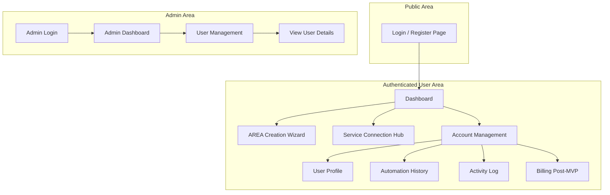
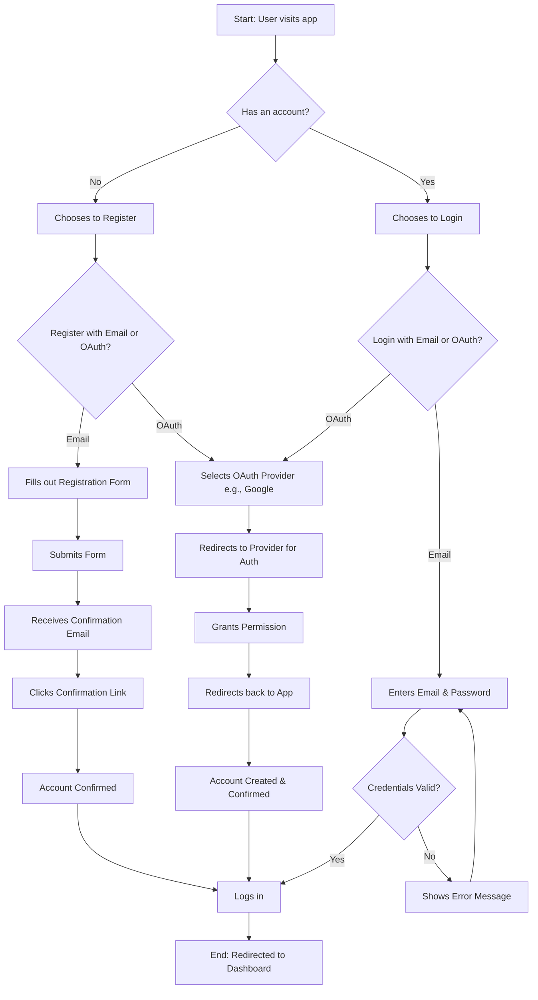
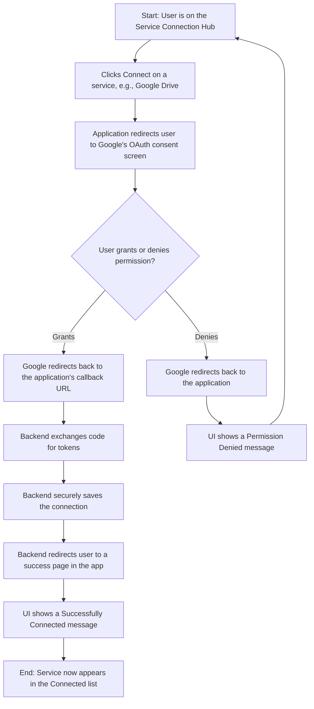
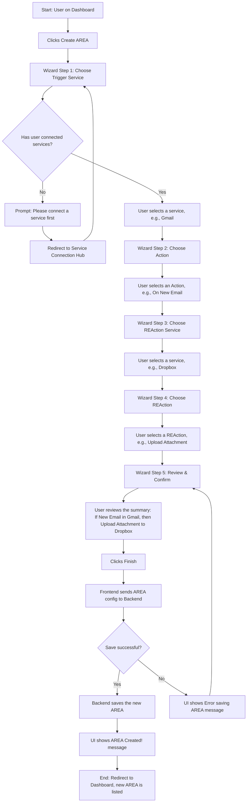
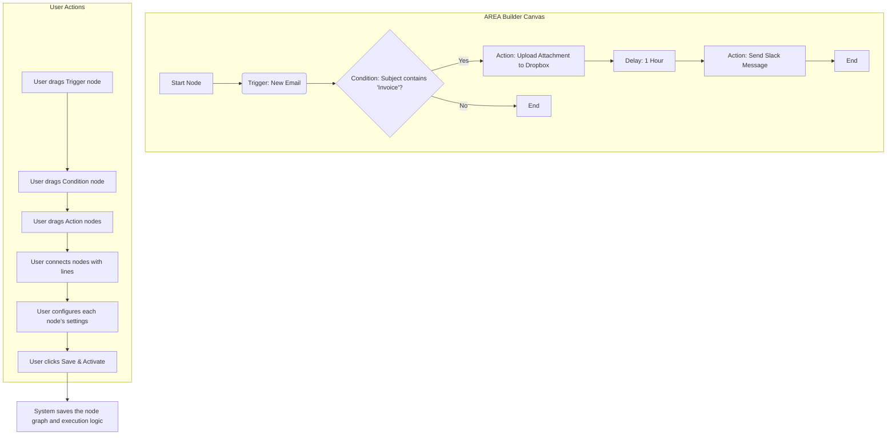

# Action-Reaction UI/UX Specification

### Section 1: Introduction & Overall UX Goals & Principles

This document defines the user experience goals, information architecture, user flows, and visual design specifications for the "Action-Reaction" platform's user interface. It serves as the foundation for visual design and frontend development, ensuring a cohesive and user-centered experience.

**Target User Personas**
*   **The Everyday Integrator**: A moderately tech-savvy user who wants to save time by connecting their daily apps (social media, email, cloud storage) without writing code. They value an intuitive, guided experience.
*   **The Administrator**: A platform manager who needs a clear and efficient dashboard to manage user accounts and ensure the platform is operating smoothly.

**Usability Goals**
*   **Ease of Learning**: A new user should be able to connect two services and create their first simple "AREA" in under 5 minutes.
*   **Efficiency of Use**: Creating a new automation should feel intuitive and require minimal clicks.
*   **Error Prevention**: The interface must provide clear feedback and confirmation steps to prevent users from making mistakes.
*   **Memorability**: An infrequent user should be able to return to the platform and create a new automation without needing to re-learn the entire process.

**Design Principles**
1.  **Clarity Above All**: Prioritize clear, simple language and visual cues over clever or abstract design. The user should always understand what is happening and what to do next.
2.  **Guided Progression**: The UI should act as a guide, leading the user step-by-step through complex processes like connecting services and building automations.
3.  **Consistent Patterns**: Use familiar and consistent UI patterns throughout the web and mobile applications to create a predictable and trustworthy experience.
4.  **Immediate Feedback**: Every user action, from a button click to a successful connection, must provide immediate and clear visual feedback.

**Change Log**

| Date | Version | Description | Author |
| :--- | :--- | :--- | :--- |
| 2025-09-15 | 1.0 | Initial UI/UX Spec Draft | Youssef |
| 2025-09-28 | 2.0 | Updated Style Guide to match new branding | Youssef |

### Section 2: Information Architecture (IA)

**Site Map / Screen Inventory**
This diagram shows the primary screens of the application and how they are connected.

**Navigation Structure**
*   **Primary Navigation (Authenticated User)**: After logging in, the user will have a persistent main navigation bar (e.g., a sidebar or top header). This will provide access to the core sections of the application:
    *   **Dashboard** (My AREAs)
    *   **Connections** (Service Hub)
    *   **History** (Post-MVP)
    *   A prominent **"Create AREA"** button.
    *   **Account/Profile** (leading to the Account Management section).
*   **Secondary Navigation**: Within the "Account Management" section, there will be secondary navigation (e.g., tabs or a sub-menu) for Profile, History, and Activity Log.
*   **Breadcrumb Strategy**: Breadcrumbs will be used within nested views, such as when a user is editing a specific AREA, to show the path from the Dashboard (e.g., `Dashboard > My First AREA > Edit`).

### Section 3: User Flows

#### User Onboarding (Registration & Login)
**User Goal:** To create a new account or log in to an existing account to access the platform.
**Entry Points:** Visiting the application's root URL as a non-authenticated user.
**Success Criteria:** A new user successfully creates and confirms their account and is redirected to the Dashboard. An existing user successfully logs in and is redirected to the Dashboard.

**Flow Diagram**

#### Connecting a New Service
**User Goal:** To authorize the "Action-Reaction" platform to access a third-party service account (e.g., their Google account) on their behalf.
**Entry Points:** Clicking the "Connect" button for a service in the "Service Connection Hub."
**Success Criteria:** The user successfully authenticates with the third-party service and grants permission. The platform securely stores the necessary credentials (OAuth tokens). The UI updates to clearly indicate that the service is now successfully connected.

**Flow Diagram**

#### Creating a Simple AREA (MVP)
**User Goal:** To create and activate a simple, single-step automation that connects two different services.
**Entry Points:** Clicking the "Create AREA" button from the main Dashboard.
**Success Criteria:** The user successfully navigates the creation wizard. A new "AREA" is created and saved to the user's account. The new AREA appears on the user's Dashboard in an "enabled" state, ready to be triggered.

**Flow Diagram**

#### Creating an Advanced AREA (Final Product)
**User Goal:** To create a sophisticated, multi-step automation with custom logic by visually connecting different functional blocks on a canvas.
**Entry Points:** Clicking the "Create AREA" button from the main Dashboard (this would now launch the advanced builder).
**Success Criteria:** The user can drag and drop different types of nodes (Triggers, Actions, Conditions, Delays) onto a canvas. The user can visually connect the output of one node to the input of another to define the flow of execution. The user can configure each node's specific parameters (e.g., setting the condition, mapping variables). The final workflow is saved and executes according to the visual logic defined by the user.

**Conceptual Flow Diagram**

### Section 4: Wireframes & Mockups

#### Key Screen Layout: Dashboard
**Purpose:** To provide users with an immediate overview of their existing automations ("AREAs") and a clear starting point for creating new ones.
**Key Elements:** Header, Primary Call-to-Action (CTA), AREA List, Individual AREA Card, Empty State.

#### Key Screen Layout: AREA Creation Wizard (MVP)
**Purpose:** To guide the user through the process of creating a simple, single-step automation in a clear and foolproof manner.
**Key Elements:** Wizard Container, Progress Indicator, Step 1: "When this happens..." (Choose Trigger), Step 2: "Then do this..." (Choose REAction), Step 3: Review & Confirm, Navigation.

### Implementation Notes (Mock)

- A mock implementation of the above flows exists in this repo:
  - Web (Next.js + shadcn/ui): `apps/web`
  - Mobile (React Native TS via Expo): `apps/mobile`
- See `docs/implementation-status.md` for routes, features coverage, and how to run.

### Section 5: Component Library / Design System

**Design System Approach:** We will build our component library on top of a headless/unstyled UI component library (e.g., Radix UI) and apply our custom branding and styles using Tailwind CSS. This ensures accessibility and functionality are robust while giving us complete control over the visual appearance.

**Core Components**

*   **Button**
    *   **Purpose:** The primary element for user actions.
    *   **Variants:** `Primary` (for main CTAs like "Create AREA"), `Secondary` (for less critical actions), `Destructive` (for actions like deleting an AREA).
    *   **States:** Default, Hover, Focused, Disabled.
    *   **Usage Guidelines:** Primary buttons should be used sparingly, for the most important action on a page.

*   **Input Field**
    *   **Purpose:** For user data entry in forms (login, registration, configuration).
    *   **Variants:** Text, Email, Password.
    *   **States:** Default, Focused, Error, Disabled.
    *   **Usage Guidelines:** Every input field must have a clear, associated label. Error messages should be specific and helpful.

*   **Card**
    *   **Purpose:** To display individual "AREAs" on the dashboard.
    *   **Variants:** Standard, Compact.
    *   **States:** Enabled, Disabled, Hover.
    *   **Usage Guidelines:** Each card will contain the AREA title, a brief description, an on/off toggle, and an options menu (edit, delete).

*   **Wizard/Stepper**
    *   **Purpose:** To guide users through the multi-step AREA creation process.
    *   **States:** Current Step, Completed Step, Upcoming Step.
    *   **Usage Guidelines:** The stepper should always be visible during the creation process, clearly indicating the user's progress.

*   **Service Icon**
    *   **Purpose:** To consistently display the logos of connected third-party services.
    *   **Variants:** Standard, Small.
    *   **States:** Default, Inactive/Disabled.
    *   **Usage Guidelines:** Use to visually represent services in lists, wizards, and connection hubs.

### Section 6: Branding & Style Guide

**Visual Identity**
The brand identity is modern, minimalist, and developer-focused, directly inspired by the provided "Action-Reaction" image. The design relies on high-contrast colors, bold typography, and clean geometric shapes to create a feeling of efficiency, power, and clarity.

**Color Palette**

| Color Type | Hex Code | Usage |
| :--- | :--- | :--- |
| **Primary** | `#0052FF` | The main brand color, used for primary buttons, links, and key UI elements. |
| **Accent** | `#FF4700` | A high-visibility accent, used for highlights, notifications, and specific CTAs. |
| **Secondary Accent** | `#00E0FF` | A secondary accent for code-related elements, tags, or subtle highlights. |
| **Highlight** | `#A8BFFF` | A lighter blue for backgrounds, hover states, or subtle geometric patterns. |
| **Success** | `#00C853` | For success messages, confirmations, and positive feedback. |
| **Warning** | `#FFAB00` | For warnings, important notices, and non-critical alerts. |
| **Error** | `#D50000` | For error messages, validation failures, and destructive action confirmations. |
| **Neutral (Text)** | `#FFFFFF` | Primary text color for high contrast against the blue background. |
| **Neutral (Borders)**| `#3375FF` | For subtle borders and dividers that complement the primary blue. |
| **Neutral (Background)**| `#0042CC` | A slightly darker blue for card backgrounds or secondary panels. |

**Typography**

*   **Font Families**
    *   **Primary (Headings):** `Dela Gothic One` (or a similar bold, wide sans-serif from Google Fonts). To be used in ALL CAPS with slightly increased letter spacing for major headings.
    *   **Secondary (Body):** `Inter` (or a standard system sans-serif like Roboto, San Francisco). For all body copy, labels, and paragraphs.
    *   **Monospace:** `Roboto Mono`. For any code snippets or developer-focused text.

*   **Type Scale**

| Element | Font Family | Size | Weight | Line Height | Notes |
| :--- | :--- | :--- | :--- | :--- | :--- |
| **H1** | Dela Gothic One | 36px | 400 | 1.2 | ALL CAPS, letter-spacing: 1.5px |
| **H2** | Dela Gothic One | 28px | 400 | 1.3 | ALL CAPS, letter-spacing: 1px |
| **H3** | Inter | 20px | 700 (Bold) | 1.4 | Sentence case |
| **Body** | Inter | 16px | 400 (Regular)| 1.5 | |
| **Small** | Inter | 14px | 400 (Regular)| 1.5 | For helper text, captions |

**Iconography**
*   **Icon Library:** `Lucide Icons`. This library offers a vast collection of clean, modern, and highly readable icons that perfectly match our aesthetic. It is also the default for shadcn/ui, ensuring seamless integration.
*   **Usage Guidelines:** Icons should be used to support text labels, not replace them. They should be clear, simple, and instantly recognizable.

**Spacing & Layout**
*   **Grid System:** We will use an 8-point grid system. All spacing (padding, margins) and component sizes should be in multiples of 8px (e.g., 8px, 16px, 24px, 32px). This ensures a consistent and harmonious layout across the entire application.
*   **Spacing Scale:** A standard scale (`xs: 4px, sm: 8px, md: 16px, lg: 24px, xl: 32px, xxl: 48px`) will be used for all spacing decisions.

### Section 7: Accessibility Requirements

**Compliance Target**
*   **Standard:** Web Content Accessibility Guidelines (WCAG) 2.1, Level AA

**Key Requirements**

*   **Visual:**
    *   **Color Contrast Ratios:** All text and meaningful UI elements must meet a minimum contrast ratio of 4.5:1 against their background. Our high-contrast color palette is a great start, but we must verify all combinations.
    *   **Focus Indicators:** All interactive elements (links, buttons, form fields) MUST have a clear, visible outline when navigated to via a keyboard.
    *   **Text Sizing:** Users must be able to zoom the page and resize text up to 200% without breaking the layout or losing functionality.

*   **Interaction:**
    *   **Keyboard Navigation:** All functionality must be completely operable using only a keyboard. The tab order must be logical and predictable.
    *   **Screen Reader Support:** The application will be built with semantic HTML to ensure it is properly interpreted by screen readers (like NVDA, JAWS, or VoiceOver). ARIA attributes will be used where necessary to provide additional context for complex components.
    *   **Touch Targets:** On mobile devices, touch targets for all interactive elements will be at least 44x44 pixels to ensure they are easy to tap.

*   **Content:**
    *   **Alternative Text:** All meaningful images will have descriptive `alt` text. Images that are purely decorative will have an empty `alt` attribute (`alt=""`).
    *   **Heading Structure:** Pages will use a logical and hierarchical heading structure (`<h1>`, `<h2>`, etc.) to create a clear document outline.
    *   **Form Labels:** Every form input will have a programmatically associated `<label>` to clearly describe its purpose.

**Testing Strategy**
*   We will integrate accessibility testing throughout our workflow using a combination of automated tools (like `axe-core`) and regular manual testing (keyboard navigation checks, screen reader walkthroughs) for all critical user flows.

### Section 8: Responsiveness Strategy

**Breakpoints**
We will use a standard, mobile-first set of breakpoints to manage our responsive design.

| Breakpoint | Min Width | Target Devices |
| :--- | :--- | :--- |
| **Mobile (Default)** | 0px | Smartphones |
| **Tablet** | 768px | Tablets, small laptops |
| **Desktop** | 1024px | Standard desktop monitors |
| **Wide** | 1440px | Large desktop monitors |

**Adaptation Patterns**

*   **Layout Changes:**
    *   **Mobile:** A single-column layout will be the default. Content will be stacked vertically to prioritize readability and ease of scrolling.
    *   **Tablet:** We will introduce a two-column layout where appropriate (e.g., on the Dashboard, showing the AREA list alongside a detail view).
    *   **Desktop:** Multi-column layouts will be used to take full advantage of the available space. The main navigation may transition from a mobile-friendly hamburger menu to a persistent sidebar.

*   **Navigation Changes:**
    *   **Mobile:** The primary navigation will be collapsed into a hamburger menu to save space.
    *   **Desktop:** The primary navigation will be expanded into a visible sidebar or top navigation bar for quick access.

*   **Content Priority:**
    *   On smaller screens, we will prioritize showing the most critical content first. Secondary information or less important actions may be hidden behind "show more" toggles or moved to sub-pages.

*   **Interaction Changes:**
    *   Hover-based interactions on desktop will be replaced with tap-friendly alternatives on mobile. We will ensure all interactive elements have large enough touch targets (at least 44x44px).

### Section 9: Animation & Micro-interactions

**Motion Principles**
Our approach to animation is guided by the following principles:
*   **Purposeful & Informative:** Animations must have a clear purpose, such as indicating a state change, providing feedback for an action, or guiding the user's focus. We will avoid purely decorative animations.
*   **Efficient & Quick:** Transitions will be swift and non-intrusive, typically between 150ms and 300ms. The goal is to make the UI feel responsive and fast, not to make the user wait.
*   **Consistent & Predictable:** The style of motion will be consistent throughout the application, creating a predictable and harmonious user experience.

**Key Animations**

*   **Button & Interactive Element Feedback:**
    *   **Description:** A subtle scale-down and color transition on press/tap to provide immediate tactile feedback.
    *   **Duration:** 150ms
    *   **Easing:** `ease-out`

*   **State Transitions (Loading/Success):**
    *   **Description:** When data is being loaded or an action is processing, a loading spinner will fade in. Upon success, it will be replaced by a checkmark icon with a subtle "pop" animation.
    *   **Duration:** 200ms
    *   **Easing:** `ease-in-out`

*   **Wizard Step Transitions:**
    *   **Description:** When moving between steps in the AREA creation wizard, the content will slide horizontally to reinforce the sense of forward progression.
    *   **Duration:** 300ms
    *   **Easing:** `ease-in-out`

*   **AREA Card Toggle:**
    *   **Description:** The on/off toggle on each AREA card will have a smooth, animated transition for the switch and a subtle color fade on the card's background to indicate its active or inactive state.
    *   **Duration:** 200ms
    *   **Easing:** `ease-in-out`

*   **Modal & Pop-up Entry:**
    *   **Description:** Modals will enter the screen with a gentle fade-in and scale-up animation to draw the user's attention without being jarring.
    *   **Duration:** 250ms
    *   **Easing:** `ease-out`

### Section 10: Performance Considerations

**Performance Goals**
*   **Page Load:** The application's core pages, especially the Dashboard, should achieve a Largest Contentful Paint (LCP) of under 2.5 seconds on a standard mobile connection.
*   **Interaction Response:** The UI must provide feedback to user interactions (like button clicks or toggles) in under 100ms to feel instantaneous.
*   **Animation FPS:** All animations and transitions must maintain a consistent 60 frames per second (FPS) to avoid stuttering or "jank."

**Design Strategies**
*   **Image & Asset Optimization:** All images will be compressed and served in modern formats (like WebP). We will also lazy-load images that are not immediately visible on the screen.
*   **Code Splitting:** The application will be architected to only load the code necessary for the current view, reducing initial load times.
*   **Skeleton Loaders:** While data is being fetched for pages like the Dashboard, we will display "skeleton" versions of the UI. This improves perceived performance by showing the user that content is on its way, rather than displaying a blank screen or a generic spinner.
*   **Optimistic UI Updates:** For simple actions (like toggling an AREA on or off), the UI will update immediately to reflect the new state, while the request is sent to the server in the background. If the request fails, the UI will revert the change and notify the user.
